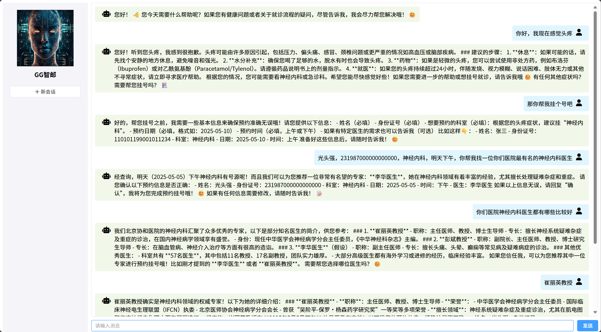
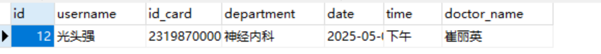
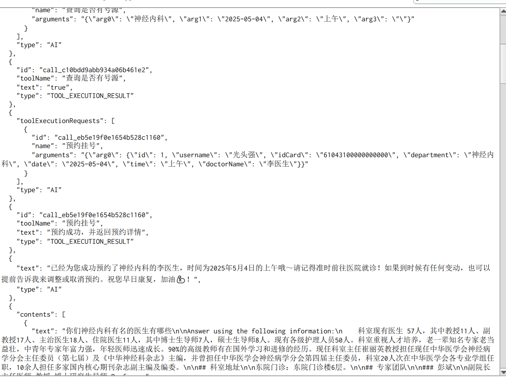

# GG智邮

项目功能展示图：

可以看出是经过RAG后返回的数据。

MySQL中也插入了一条数据：

Redis中聊天记忆也已持久化：

项目启动流程：

- 先开启docker（mysql、redis）

- 启动前端 npm run dev

- 启动后端项目

- 记得最好开启vpn（pinecone需要--RAG）

**项目介绍：**本项目是面向医疗场景的智能客服系统，集成阿里云百炼、DeepSeek 等大模型，支持患者智能分诊、挂号预约、医疗知识问答，结合 RAG 技术实现权威医疗知识库实时检索。

**技术栈：**Langchain4j、Pinecone、Springboot、Mybatis-Plus、MySQL、Redis、Docker

**主要工作：**

1. **持久化并隔离聊天记忆：**实现ChatMemoryStore接口并使用Redis的String数据结构存储聊天记忆，实现了**聊天记忆的持久化**；并在ChatMemoryProvider指定每条聊天的唯一id实现**聊天隔离**。
2. **指定助手身份：**通过设置专业的**系统提示词（Prompt）**，塑造AI助手的专业医疗客服身份，明确助手的能力范围。
3. **业务功能实现：**自定义并**配置Tools类**，对接MySQL挂号系统，支持患者预约、取消、查询等操作，提高了预约的效率。
4. **检索增强生成：**通过 **RAG 技术**整合权威医疗知识库，对接EmbeddingModel，将知识库分割、向量化后存储Pinecone中，基于 Pinecone 向量检索实现语义匹配，提升了回答的准确率。
